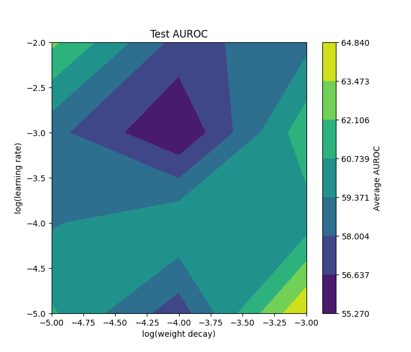

# CheXpert X-Ray Labeling Project

This project implements and trains a **Convolutional Neural Network (CNN)** to classify chest X-ray images from the [**CheXpert dataset**](https://stanfordmlgroup.github.io/competitions/chexpert/) by the Stanford ML Group.

The goal is to build and understand deep learning pipelines for medical image classification.

As of October 2025, I am in the process of **hyperparamter optimization (v2.2)**.


# Usage

1. Preprocess the data:
   - Use `process_data.py` to convert downloaded CheXpert images and labels into NumPy arrays.
   - To manage memory, limit the dataset (~10,000) using a stopping condition in the loop.

2. Train the CNN:
   - Run `Network_2.2.py`: to train the model.
   - If training is too long, use save/read functions to restart.

```python
python3 Network_2.2.py -lr LEARNING_RATE -wd WEIGHT_DECAY -epochs EPOCHS > log.txt
```

# Development Progress

| Version | Description |
|----------|--------------|
| v1.0 | Built CNN architecture entirely in NumPy, trained on small subsets of CheXpert. |
| v1.1–v1.2 | Added momentum, batch processing, and partial parallelization across channels. |
| v2.0 | Migrated to PyTorch, introduced residual layers, Adam optimizer, and AUROC as main metric. |
| v2.1 | Refined training loop: ignored unlabeled samples, improved learning rate scheduling, and added bottleneck blocks. |
| v2.2 (Current) | Designed for hyperparameter sweeps  (learning rate, weight decay, batch size). Robust and modular for experimentation. |

# Model Description 
The model uses a deep residual CNN architecture implemented in PyTorch.

Architecture highlights (v2.2):
- Input is frontal-view X-ray images resized to 224 × 224
- Base convolutional layers with BatchNorm + ReLU
- Bottleneck residual blocks
- Fully connected classifier head
- AUROC as primary performance metric

# Example output files

| File | Description |
|----------|--------------|
| `sample_output/` | model checkpoint and sample output |

# Hyperparameter Sweep

I am currently finding the best (learning rate, weight decay) parameters. Here are the AUROC for training set and test set for the 12 combinations. Currently the best test set AUROC is still around 60%. 




I am currently investigating the cost for this overfitting and trying hyperparameter sweeps with better grib and improved granularity.

# Limitations

1. Logging and monitoring: Training logs are currently minimal. Future versions will integrate TensorBoard or Weights abd Biases.

2. Data coverage: 
Only frontal X-ray views are used. Adding lateral-view images or multi-view fusion could improve classification accuracy.

3. Evaluation metrics:
Current results use AUROC only. Future evaluation may include F1-score, precision-recall AUC, or calibration metrics.


# Motivation

This project was built when reading Chapter 10 of Understanding Deep Learning by Simon Prince.
